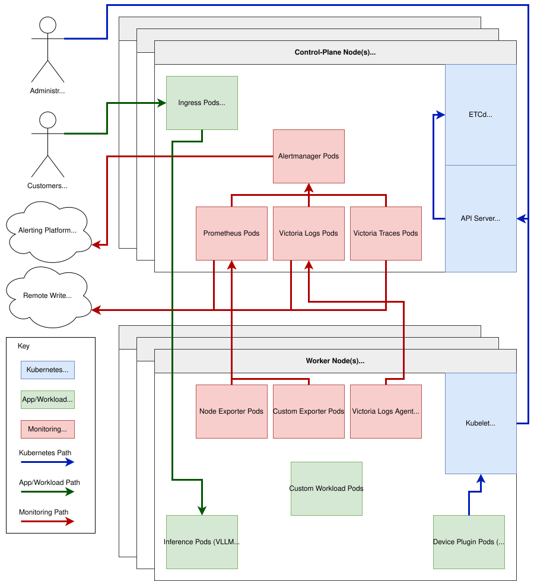

# get-fairport-io

An opinionated full stack platform including everything from bare-metal provisioning to AI inference/training and everything in between. Simple enough to be installed and managed by a single person, powerful enough to support thousands of machines, gpus, and developers.

# Quick Start

```shell
curl https://get.fairport.io | sudo bash -
```

# Table of Contents

- [Quick Start](#quick-start)
- [Operations](#operations)
  - [Create A New Cluster](#create-a-new-cluster)
  - [Add Node To Existing Cluster](#add-node-to-existing-cluster)
    - [Using the Helper Script](#using-the-helper-script)
    - [Using FP Node Manager](#using-fp-node-manager)
    - [Manually](#manually)
  - [Kubernetes Version Upgrades](#kubernetes-version-upgrades)
  - [Fairport Version Upgrades](#fairport-version-upgrades)
  - [Common Configuration Options](#common-configuration-options)
  - [Uninstall](#uninstall)
  - [Infrastructure As Code](#infrastructure-as-code)
    - [Ansible](#ansible)
    - [Terraform](#terraform)
- [Architecture](#architecture)
  - [Diagrams](#diagrams)
  - [Capabilities](#capabilities)
  - [Limitations](#limitations)
  - [Network](#network)
- [Air-Gap](#air-gap)

# Operations

## Create A New Cluster

> [!IMPORTANT]
> Minimum Requirements: 2 CPU, 8GB Memory, 100GB SSD (or NVME) (More is always better!)

> [!IMPORTANT]
> By default, the cluster uses `100.64.0.0/10` & `fd00:10:42::/47` (CGNAT & ULA ranges) for pods & services.  Use a different range if it overlaps with any internal networks or if you use an application like Tailscale by following this example:
>
> ```
> export RKE2_CLUSTER_CIDR="10.144.0.0/12"
> export RKE2_SERVICE_CIDR="10.160.0.0/12"
> curl https://get.fairport.io | sudo -E bash -
> ```

> [!IMPORTANT]
> To override default values from the Fairport Helm Chart during installation by defining them in a file and then setting the `FAIRPORT_CONFIG_FILE` environment variable.  Here is a simple example:
>
> ```
> export FAIRPORT_CONFIG_FILE=/opt/fp-values.yaml
> cat << EOF > $FAIRPORT_CONFIG_FILE
> monitoring:
>   kube-prometheus-stack:
>     enabled: false
> EOF
> curl https://get.fairport.io | sudo -E bash -
> ```

> [!NOTE]
> You can read and verify the source code before running the installer here: https://get.fairport.io/

To create a new cluster run this command:

```shell
curl https://get.fairport.io | sudo bash -
```

## Add Node To Existing Cluster

### Using the Helper Script

Log into a control-plane/server node and run one of the following commands to generate a script used to join the cluster. Run the script on the node you want to add to the cluster.

- **Agent/Worker**: `/usr/local/bin/fp-add-agent`
- **Server/Control-plane**: `/usr/local/bin/fp-add-server`

### Using FP Node Manager

> [!IMPORTANT]
> Work in progress

The kubernetes cluster can also add nodes if a SSH public key is installed on the target nodes.

```shell
cat << EOF | kubectl apply -f -
---
apiVersion: v1
kind: ConfigMap
metadata:
  name: worker-1                     # Required (Unique name)
  namespace: fairport                # Required: fairport
  labels:
    fairport.io/node: 'true'         # Required ('true')
data:
  ip: '127.0.0.1'                    # Required
  type: 'agent'                      # Default: agent
  ssh_user: 'fairport'               # Default: fairport
  ssh_port: '22'                     # Default: 22
  ssh_secret_name: 'fp-ssh-keys'     # Default: fp-ssh-keys
  ssh_secret_namespace: 'tinkerbell' # Default: tinkerbell
  ssh_secret_key: 'id_rsa'           # Default: id_rsa
  pre_install_cmd: |
    echo hi                          # Default: ''
  post_install_cmd: |
    echo bye                         # Default: ''
EOF
```

### Manually

You can also generate your own join script by using the following method:

```shell
export RKE2_TYPE=""   # Options: [agent|server]
export RKE2_SERVER="" # Format: https://<SERVER_IP>:9345
export RKE2_TOKEN=""  # Content of /var/lib/rancher/rke2/server/node-token
curl https://get.fairport.io | sudo -E bash -
```

## Kubernetes Version Upgrades

> [!IMPORTANT]
> - Read the Kubernetes blog page for the specific target version (https://kubernetes.io/blog/ ) before upgrading.  It contains things like api additions, deprectations, and other changes.
> - Use tools like [kubepug](https://github.com/kubepug/kubepug) to scan for deprecated objects before upgrading.
> - Only upgrade a maximum of one minor version at a time (v1.20 -> 1.21).
> - Upgrade control-plane nodes before worker nodes.
> - Upgrade one node at time unless you're absolutely sure you know what you're doing.
> - On the target machine change the Kubernetes version from https://github.com/rancher/rke2/releases and then re-run the installer with the `RKE2_VERSION` environment variable set.

```shell
export RKE2_VERSION=vX.Y.Z+rke2r1
curl https://get.fairport.io | sudo -E bash -
```

## Fairport Version Upgrades

> [!IMPORTANT]
> Check the release changelogs before upgrading (https://github.com/fairport-io/fairport-io/releases).

On a control-plane machine (or with a properly configured kubeconfig), patch the fairport `helmchart` object with the target version (https://github.com/fairport-io/fairport-io/releases):
```shell
# Change X.Y.Z to the target version:
fpk patch helmchart fairport -n kube-system --type merge -p '{"spec":{"version":"X.Y.Z"}}'
```

## Common Configuration Options

The installer supports all of the RKE2 environment variable configs (https://docs.rke2.io/reference/server_config).  These are some of the more common ones and Fairport configuration options:

| Variable                   | Description |
| :---                       | :---        |
| `RKE2_TYPE`                | The type of node to install (`server` or `agent`). |
| `RKE2_SERVER`              | The URL/IP of an existing server node (e.g., `https://<SERVER_IP>:9345`). **Required** if `RKE2_TYPE` is `agent`. |
| `RKE2_TOKEN`               | The node token used to join the cluster. **Required** if `RKE2_TYPE` is `agent`. |
| `RKE2_VERSION`             | The specific RKE2 release version to install (e.g., `v1.36.1+rke2r2`). |
| `RKE2_CNI`                 | The Container Network Interface (CNI) plugin to install. |
| `RKE2_CLUSTER_CIDR`        | The CIDR block(s) to use for pod IPs. Automatically detects IPv4/IPv6 defaults. |
| `RKE2_SERVICE_CIDR`        | The CIDR block(s) to use for service IPs. Automatically detects IPv4/IPv6 defaults. |
| `FAIRPORT_CHART_VERSION`   | The version of the Fairport Helm chart to install. |
| `FAIRPORT_CHART_SOURCE`    | The Helm chart source repository/URL for Fairport. |
| `FAIRPORT_CHART_NAMESPACE` | The dedicated namespace where Fairport components are installed. |
| `FAIRPORT_CONFIG_FILE`     | Path to a custom YAML file containing Helm values for the Fairport installation. |
| `FP_DEBUG`                 | Set to `true` to enable verbose bash debugging output (`set -x`). |

## Uninstall

```shell
curl https://get.fairport.io | sudo bash -s -- uninstall
```
## Infrastructure As Code

People and/or organizations may want to manage their clusters using Infrastructure as Code (IaC) tools such as Ansible and Terraform.  You can find samples of both in this repository.

### Ansible

- [Ansible Playbook](iac/ansible/sample-playbook.yml)
- [Ansible Inventory](iac/ansible/sample-inventory.yml)

### Terraform

- [Terraform Configuration](iac/terraform/main.tf)

# Architecture

## Diagrams



## Capabilities

> [!NOTE]
> The Fairport stack is built on top of RKE2.  The rationale being:
> - Ultra-lightweight (ships in a single binary).
> - Only requires 2CPUs and 8GB of memory.
> - Simple to setup.
> - Approved for government use.
> - FIPS & SELinux compatible.
> - Air-Gap & offline capabilities.
> - Plug & Play capabilities with many CNI providers and architectures.
> - Closely follows and conforms to upstream Kubernetes development.
> - Works with almost any Linux distribution that uses systemd (and even limited support for Windows).
> - Possible to run locally on Linux, Windows, or MacOS (with VMs): https://github.com/fairport-io/fairport-io/blob/main/docs/LIMA.md
> - Well documented and supported.

> [!NOTE]
> Additional capabilities of Fairport's stack which are not part of Kubernetes and/or RKE2 can be found here: https://github.com/fairport-io/fairport-io/tree/main/charts/fairport#default-features

| Capabilities                 | Description |
| :---                         | :---        |
| **High Availability**        | Both the control-plane and worker nodes can have redundant nodes to ensure high availability.  This means that if there are 3 control-plane nodes and one dies, the cluster will continue to work without intervention.  This also means that if your app has 3 replicas and one dies, it will continue to run normally if properly configured. This also means you can migrate control-plane nodes and workloads without downtime |
| **Service Discovery**        | Workloads inside the cluster can use service discovery to find and connect to other containers and services using names. |
| **Scaling/Autoscaling**      | Policies can be configured to either manually or automatically add or remove containers to a workload. |
| **Isolation**                | Workloads can be isolated from each other using namespaces and resource quotas.<br><br>Containers can also be isolated from each other with network policies that act like cluster firewalls. |
| **Self-Healing**             | The cluster can automatically restart failed containers, and reschedule them to healthy nodes to maintain availability. |
| **Load Balancing**           | The cluster can automatically distribute network traffic across healthy nodes to ensure optimal performance and availability. |
| **Job Scheduling**           | Runs batched or scheduled jobs (non-continuous workloads) with fine-grained capabilities. |
| **Topology Awareness**       | The cluster can schedule pods across multiple nodes based on their topology requirements.<br><br>This can include: CPU, memory, Corsair (AIP), rack, region, datacenter, etc. |
| **Configuration Management** | Operators can manage and update the cluster using yaml configurations. These can be applied from a repo such as an IAC (Infrastructure as Code) git repository using a CI/CD system or manually with the kubectl tool. |
| **Secret Management**        | The cluster can store and manage sensitive information such as passwords, API keys, and other secrets in a secure and centralized manner. |
| **Role-Based Access Control (RBAC)** | Provides fine-grained access control to manage user permissions and access to cluster resources. |
| **Hybrid Cloud**             | Mix and match onprem nodes, cloud nodes, and edge nodes to build your clusters (control-plane recommended to be in the same region or datacenter) |

## Limitations

> [!IMPORTANT]
> The default configuration will use CGNAT (Carrier Grade NAT)  IPv4 range and the ULA (Unique Local Address) IPv6 range but is completely configurable at cluster creation time.  This is because many companies use a lot of RFC1918 address space already so using these ranges should prevent ip address conflicts.  Docs: get-fairport-io/setup at main · fairport-io/get-fairport-io 

| Limitation                       | Value     | Configurable | Description |
| :---                             | :---      | :---         | :---        |
| **Nodes Per Cluster**            | 4,096     | Yes          | The maximum number of nodes supported in the default configuration is 4096 based on the IPv4 CIDR block. In reality the control-plane IO will likely be more of a bottleneck well before  4096 nodes. |
| **Pods Per Node**                | 256       | Yes          | The maximum number of pods supported in the default configuration per node. |
| **Pods Per Cluster**             | 1,048,576 | Yes          | The maximum number of pods supported in the default configuration per cluster. |
| **Services Per Cluster**         | 4,194,304 | Yes          | The maximum number of services supported in the default configuration per cluster. |
| **Minimum CPUs Per Node**        | 2         | N/A          | The recommended absolute minimum number of CPUs a node should have. |
| **Minimum Memory (GB) Per Node** | 8         | N/A          | The recommended absolute minimum number of Memory a node should have. |
| **Disk Space**                   | 5%        | Yes          | Nodes should maintain under 85% disk utilization on the partition being used for container image storage. At 85%, Kubelet automatically deletes unused container images. If utilization grows beyond that and reaches 95% (5% available), the node flags DiskPressure and begins evicting active pods. |
| **Certificate Age**              | 1 Year    | No           | Certificates used by Kubelet and the Kubernetes API Server need to be rotated once every 365 days.  To generate new certificates, the system must restart the rke2 service.  If the cluster is routinely upgraded (as it should be) this will update certificates and it shouldn't be an issue.  If time between upgrades is more than one year, to manually rotate run: `systemctl restart rke2-agent` for workers and `systemctl restart rke2-server` for control-plane nodes. |

## Network

> [!NOTE]
> The default cluster configuration uses Cilium in VXLAN (Virtual Extensible Local Area Network) routing mode - the default for cilium on RKE2.  This means an overlay network is created on top of the nodes.  The rationale being:
> - The pod/service IP ranges can be re-used - traffic to and from outside the cluster is masqueraded (NATed) to the instance(s) running the workload.
> - Allows for clusters spanning on-prem and cloud instances.
> - BGP and Native routing modes can also still be configured if required.
> - Works with existing networks.

| Capabilities                          | Description |
| :---                                  | :---        |
| **eBPF**                              | Executes code directly within the Linux kernel, minimizing latency and drastically increasing throughput and Requests Per Second (RPS) compared to traditional iptables. |
| **Kube-Proxy Replacement**            | Completely bypasses legacy kube-proxy for load balancing, removing overhead and scaling more efficiently in large clusters. |
| **Service Mesh**                      | Replaces the need for heavy, resource-intensive sidecar proxies (like Istio), reducing memory and CPU footprints while handling service mesh features directly in the kernel. |
| **Network Policy Enforcement**        | Enforce firewall-type policies in the cluster, allowing or denying ingress and egress traffic for pods or workloads based on labels. |
| **Observability**                     | Cilium can work with the Hubble tool to provide real time traffic observability. |
| **Transparent Encryption-In-Transit** | All data-in-transit between pods is encrypted via Wireguard. |
| **Configurable Routing Modes**        | While VXLAN is the default, Cilium can integrate with BGP or native routing to expose pods directly to a network. |
| **IPv4 & IPv6**                       | Cilium will work for IPv4 and/or IPv6. |

# Air-Gap

> [!IMPORTANT]
> Documentation of the air-gap process is a work-in-progres.  This feature may not be available for GA yet.

> [!IMPORTANT]
> Ensure that your target machine has at least double the amount of disk as the installer size.

For installation in environments which are offline or with limmited internet connectivity.

1. Download the installer tarball: (work-in-progres)
2. Place the release file onto the target machine.  How this happens will depend heavily on each individual environment, but for simplicy tools like `scp` and `rsync` will work.
3. Extract the contents: `sudo tar -xvPf fairport-airgap.tar.gz`
4. Run the installer (The installer will take the same environment variables as the online installer): `sudo /usr/local/bin/fairport-airgap`
